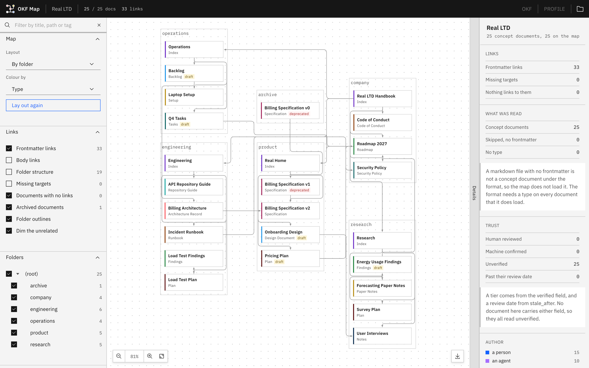

# OKF Map

OKF Map is one HTML page that draws a folder of markdown documents as a map of their Open Knowledge Format (OKF) frontmatter. Each document is a tile, and each relation key is a line. The page runs from the disk with the Carbon Design System inside it, and every file stays in the browser.

By default the page reads the frontmatter alone. The Body links switch reads each file in full, and it draws each markdown link in the prose as a dashed line. The map covers the chosen folder, so a path outside it shows as a missing target. The export control saves the map as a PNG image. The frontmatter carries the map, and the body links are a second layer that a reader can add.

| File | Description |
| --- | --- |
| `okf-map.html` | the map, with the Carbon Design System inside it |
| `icons/` | the favicon and the vector marks |
| `tests/unit/` | the unit tests of the page |
| `docs/images/` | the wide screenshot in this readme, and a square one |
| `.github/` | the tests workflow and the Dependabot settings |

 

## 1. Build and Run

    open okf-map.html                                # or open the file in any browser
    npm ci                                           # the test runner, from package-lock.json
    npm test                                         # the unit tests

The tests need Node.js 22.12 or later.

### 1.1 Specification Buttons

`okf-map.json`, at the root of the chosen folder, names the documents that the OKF and PROFILE buttons open:

    {
      "okf-google-spec": "docs/specs/open-knowledge-format.md",
      "okf-house-profile": "docs/specs/open-knowledge-format-profile.md"
    }

| Key | Button | Document |
| --- | --- | --- |
| `okf-google-spec` | OKF | the OKF specification that Google publishes |
| `okf-house-profile` | PROFILE | the house profile, which extends that specification for one organization |

Each path is relative to the folder that holds `okf-map.json`.

| Event | Result |
| --- | --- |
| left click | the document opens, or a file picker opens when the button is gray |
| right click | the file picker opens, so a different document can be chosen |
| gray button | the document is absent, and the tooltip gives the reason |
| reload | each chosen file clears, and `okf-map.json` applies again |

### 1.2 Tests

The 43 unit tests run without a browser in Node with Vitest:

| Test file | What it checks |
| --- | --- |
| `yaml.test.js` | the YAML frontmatter parser: scalars, flow and block collections, multi-line strings, comments and Windows line endings |
| `paths.test.js` | how a link path resolves to a document, and which folders count as archived or skipped |
| `links.test.js` | which frontmatter keys become lines, and which markdown links in the body count |
| `trust.test.js` | who wrote and who verified a document, its trust tier, and when it goes stale |
| `routing.test.js` | how the lines between tiles are routed around other tiles |
| `page.test.js` | that the page loads nothing from other files, apart from the Plex fonts |

The tool does not have any dependencies. `tests/unit/page.js` cuts the script at its section banners, such as `/* ---- paths */`, and runs the exact code of the page.

GitHub Actions runs `npm test` on Node.js 22 and 24 for every pull request and every push to `main`. Pull requests from Dependabot run on GitHub's own runners. Pushes and PRs to main use Blacksmith. Once a month, Dependabot proposes updates to Vitest and to the pinned actions, to be merged manually.

## 2. Directory Tree

    icons/              the favicon and the vector marks
    docs/images/        the wide screenshot in this readme, and a square one
    tests/unit/         the unit tests, and the loader of the page sections
    .github/            the tests workflow and the Dependabot settings

## 3. Rules

**Keep `okf-map.json` at the root of the bundle.** The page reads only the chosen folder, and the copy nearest the root applies when the folder holds more than one.

**Keep the page one file.** A page that the browser opens from the disk cannot fetch a library when it runs.

**Keep the banner comment of each section in the app script.** The unit tests load the logic of the page by its section banners, so a renamed or removed banner fails the tests that load it.
